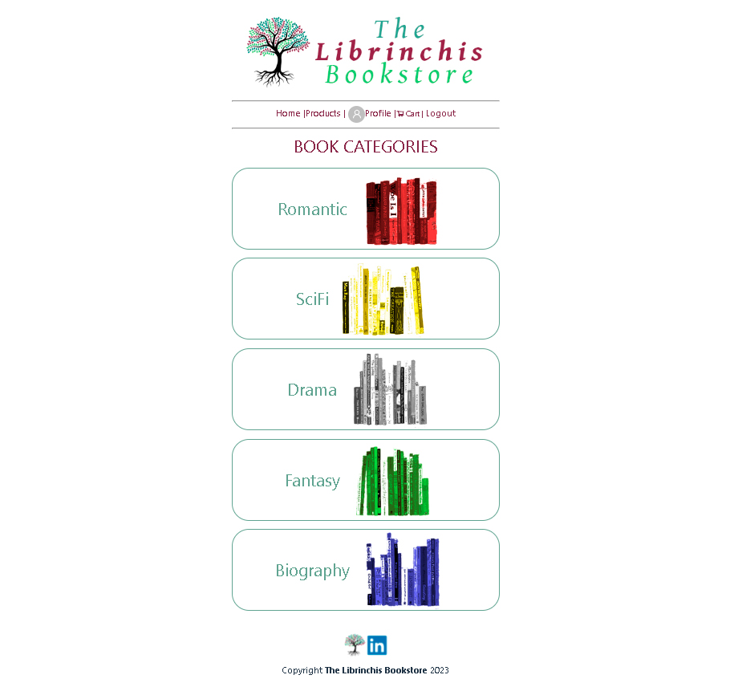
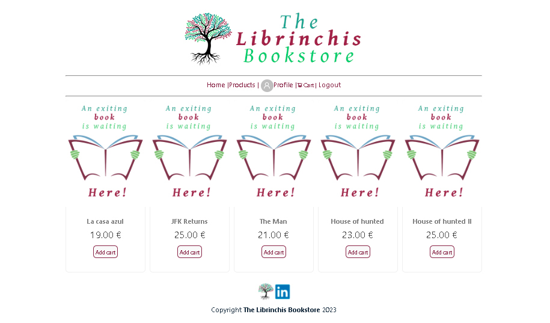
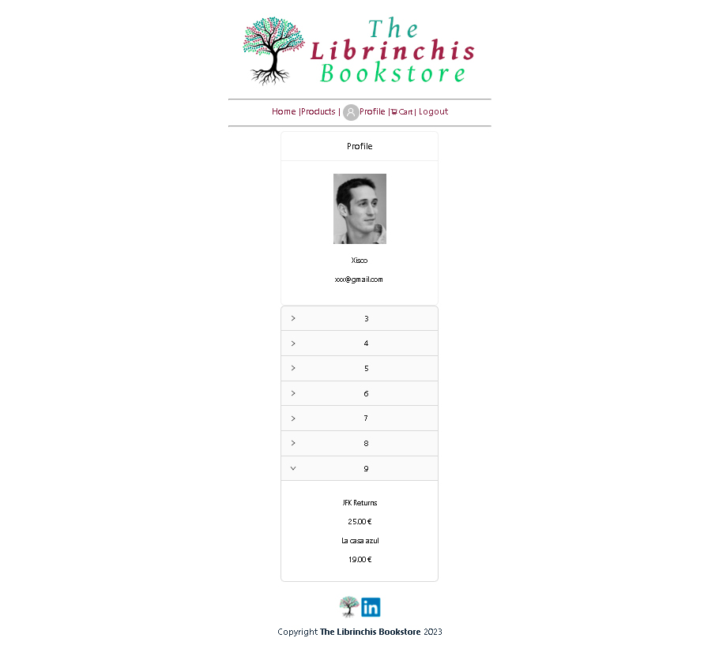
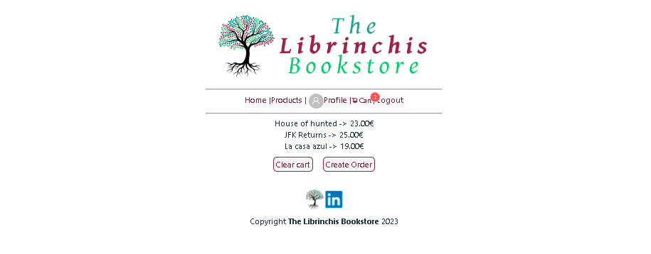
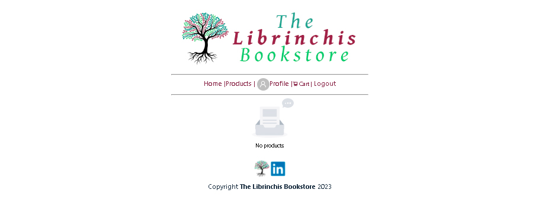

***
# INDEX
- [THE LIBRINCHIS BOOKSTORE](#the-librinchis-bookstore)
    - [Project description](#project-description)

- [SITE SECTIONS & VIEWS](#site-sections--views-)
    - [Header](#header)
    - [Footer](#footer)
    - [Home view](#home-view)
    - [Products view](#products-view)
    - [Profile view with orders](#profile-view-with-orders)
    - [Cart with products](#cart-with-products)
    - [Cart empty](#cart-empty)

- [Software used to develop the project (TOOLSET)](#software-used-to-develop-the-project-toolset-%EF%B8%8F)

- [Author](#author-%EF%B8%8F)

# THE LIBRINCHIS BOOKSTORE 📅
## Project description
[⬆️](#index)

>*THE LIBRINCHIS BOOKSTORE  stands for a new concept of reading through selected titles and authors. We're proud to offer the best stories within our five categories. *
>Some special features that will be developed on v.II will be:

>- [X] Offers popup
>- [X] Book preview
>- [X] Share book feature
>- [X] print order in pdf

***
# SITE SECTIONS & VIEWS 📅
## Header
[⬆️](#index)

***

## Footer
[⬆️](#index)

***

## Home view
[⬆️](#index)

***

## Products view
[⬆️](#index)

***

## Profile view with orders
[⬆️](#index)

***

## Cart with products
[⬆️](#index)

***

## Cart empty
[⬆️](#index)

> __Note__
Screenshots only reflect some browsing samples.

> __Warning__
Keep in mind that to be able to see the PROFILE section, you have to be loged in.

***
# Software used to develop the project (TOOLSET) ⚙️
[⬆️](#index)

>* [*VISUAL STUDIO CODE*](https://code.visualstudio.com/) - Editor de código (Version: 1.75.1)
>* [*NodeJS*](https://code.visualstudio.com/) - Entorno de ejecución para crear servidores en backend (Version: 18.15.0)
>* [*REACT*](https://es.react.dev/) - Library for Js Native interfaces (Version: 18.2.0)
>* [*ANT-DESIGN*](https://ant.design/) - Ant Design is a UI library that can be used with data flow solutions and application frameworks in any React ecosystem(Version: 5.5)
>* [*POSTMAN*](https://www.postman.com/) - API platform to check and setup endpoints (Version: 10.13.5)

***
# Author ✒️
[⬆️](#index)

**Joan Baldó** - | *Coding* | - [joanbaldo](https://github.com/joanbaldo)

***